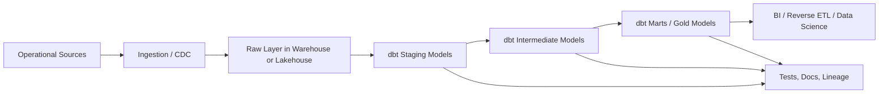
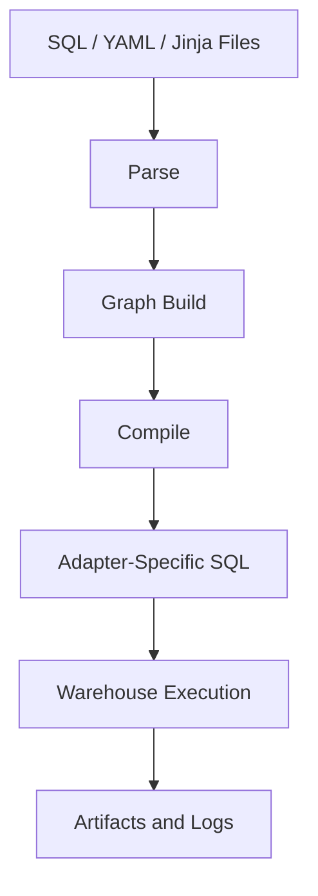
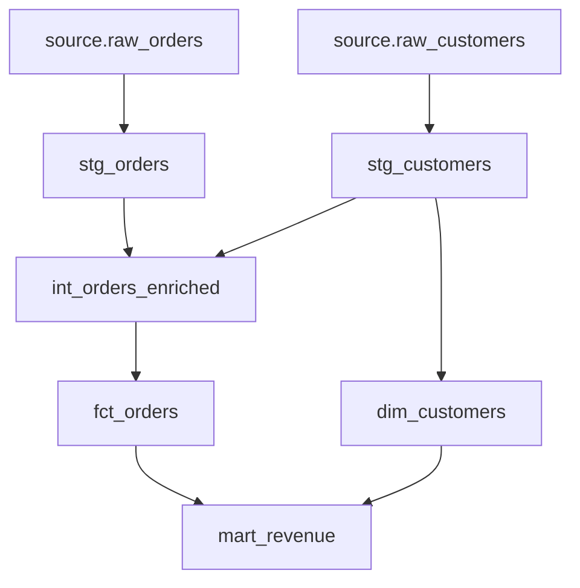
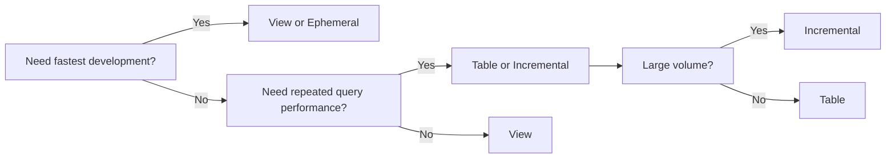
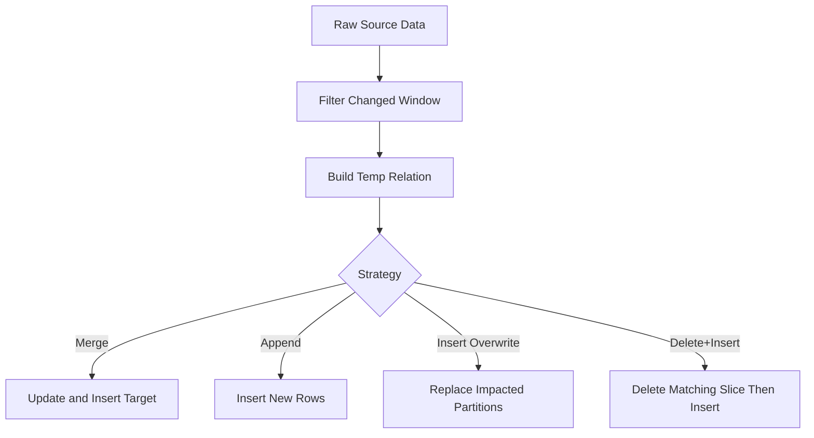
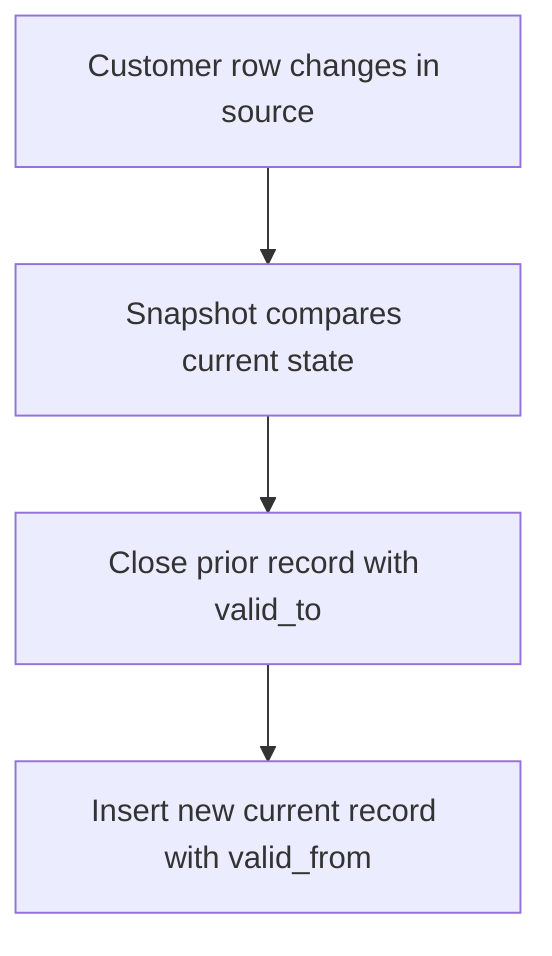
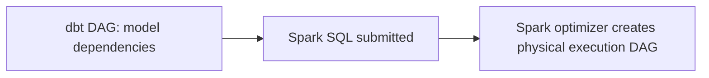
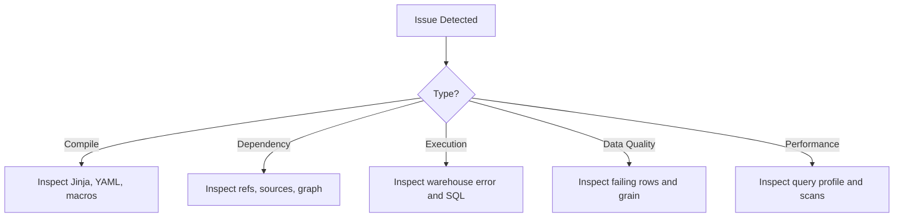
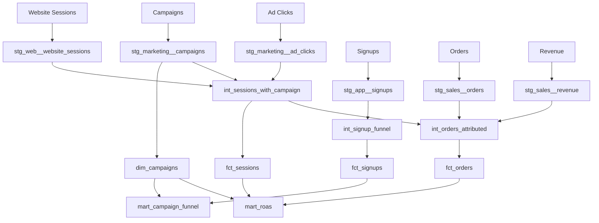

# dbt Core Enterprise Handbook

For easier reading, a chapterized version of this handbook is available in `docs/handbook/`, starting with `docs/handbook/README.md`.

This handbook teaches dbt Core from first principles through advanced enterprise design. It assumes you already understand SQL, relational modeling basics, and warehouse concepts, but are new to dbt.

The goal is not to memorize commands. The goal is to understand why dbt exists, how it works internally, where it fits in a platform, and how to build reliable, scalable, maintainable analytics engineering systems.

---

# Part 1 - Understanding dbt

## What problems dbt solves

Before dbt, many analytics teams had a common failure mode:

- raw data landed in a warehouse
- SQL transformations were scattered across BI tools, notebooks, stored procedures, or ad hoc scripts
- there was no dependency graph
- changes were hard to review
- testing was inconsistent
- documentation drifted
- production troubleshooting depended on tribal knowledge

dbt solves those problems by treating analytics SQL like software:

- models are files in version control
- dependencies are explicit through `ref()` and `source()`
- SQL is compiled deterministically
- tests are executable assets
- documentation is generated from code and metadata
- deployment and promotion can be automated

dbt is not just a transformation tool. It is a development workflow, project structure, dependency manager, compiler, testing framework, and metadata generator for analytics engineering.

## Why dbt was created

dbt was created because cloud warehouses made in-database transformation practical at scale. Once Snowflake, BigQuery, Redshift, Databricks SQL, and similar platforms made warehouse compute elastic enough, it became unnecessary to extract data out of the warehouse for many transformation workloads.

The key insight was simple:

- analysts and analytics engineers already know SQL
- business logic often belongs close to the data warehouse
- warehouses are better at set-based transformations than external orchestration scripts for many use cases

dbt emerged to provide a disciplined way to write those transformations as modular, testable, deployable code.

## ELT vs ETL

Traditional ETL:

- Extract from sources
- Transform in an external engine
- Load the transformed result into the warehouse

Modern ELT:

- Extract from sources
- Load raw data into the warehouse or lakehouse
- Transform inside the destination platform

Why ELT became dominant:

- cloud warehouses separated storage and compute
- SQL execution became cheap enough for many analytical use cases
- raw data retention enabled replay and re-modeling
- teams could centralize transformation logic in one place

When ETL is still appropriate:

- heavy row-by-row logic is easier in code than SQL
- low-latency operational processing is required
- complex machine learning feature engineering needs Python or Spark-native processing
- sensitive data must be masked before landing in the warehouse

When ELT is a strong fit:

- analytical transformations are set-based
- warehouse compute is already the main execution platform
- teams want lineage, testing, and modular SQL workflows

## Where dbt fits in the modern data stack

Typical stack:

- ingestion: Fivetran, Airbyte, custom CDC, Kafka, Spark streaming
- storage/compute: Snowflake, BigQuery, Redshift, Databricks, Spark SQL
- transform: dbt Core or dbt Cloud
- orchestration: Airflow, Dagster, Prefect, Azure Data Factory, GitHub Actions, Databricks Workflows
- BI/consumption: Power BI, Tableau, Looker, Sigma
- monitoring: Monte Carlo, elementary, custom alerts, warehouse observability



dbt does not replace ingestion, storage, or BI. It sits in the transformation and analytics engineering layer.

## dbt architecture

dbt Core has several important internal components:

- parser: reads project files and macros
- compiler: resolves Jinja, `ref()`, `source()`, configs, variables
- graph builder: constructs the DAG
- adapter: translates generic dbt behavior into warehouse-specific SQL behavior
- runner: executes nodes in dependency order using threads
- artifact writer: emits `manifest.json`, `run_results.json`, docs metadata, and logs



## How dbt differs from Spark jobs

dbt is not a general-purpose distributed compute framework. Spark is.

dbt:

- builds a dependency graph of data assets
- compiles SQL or Python models into warehouse-native execution
- delegates execution to the target engine
- focuses on analytics engineering workflows

Spark jobs:

- execute arbitrary distributed data processing logic
- support low-level control over partitions, shuffles, joins, caching, and file formats
- are suitable for ETL, ML, streaming, and custom compute-heavy transformations

Use dbt when:

- SQL expresses the logic clearly
- the warehouse or lakehouse already has the right compute engine
- governance, lineage, testing, and maintainability matter more than custom runtime control

Use Spark jobs when:

- you need procedural or iterative transformations
- you need custom file I/O behavior or non-SQL libraries
- your logic is not naturally modeled as SQL assets

## How dbt differs from stored procedures

Stored procedures are often imperative. dbt models are declarative.

Stored procedures usually say:

- do step A
- then step B
- then update table C

dbt usually says:

- this model depends on those upstream assets
- here is the SQL definition of the relation
- the DAG decides run order

Stored procedures can become opaque because business logic, orchestration, and side effects mix together. dbt encourages asset-oriented modeling with isolated transformations.

When stored procedures may still be useful:

- complex administrative actions
- warehouse-specific operational workflows
- niche transaction-oriented requirements

Common anti-pattern:

- recreating stored procedure style imperative pipelines inside dbt hooks and macros

That undermines lineage and predictability.

## How dbt differs from traditional ETL tools

Traditional ETL tools often emphasize visual pipelines and row-oriented transformation components. dbt emphasizes code-first SQL transformation.

Trade-offs:

- visual ETL can help less technical users, but complex logic often becomes harder to review
- dbt is more transparent for SQL-first teams, but requires engineering discipline

dbt typically wins when:

- the team is comfortable with SQL and Git
- transformations are mostly relational
- reproducibility, reviewability, and standardization matter

Traditional ETL may still win when:

- many users cannot code
- workflows depend heavily on non-SQL connectors and procedural transforms

## Why organizations adopt dbt

Organizations adopt dbt because it creates a common operating model for analytics transformation:

- shared definitions of metrics and dimensions
- version-controlled business logic
- testable transformations
- CI/CD compatibility
- clear lineage for change management
- reduced BI-layer logic sprawl

This improves trust in data and reduces the cost of change.

## Key takeaways

- dbt makes analytics SQL operate like software.
- It is strongest in ELT-oriented warehouse and lakehouse platforms.
- It complements, not replaces, ingestion, orchestration, BI, or Spark.
- Its real value is maintainability, lineage, testing, and standardization.

## Hands-on exercises

1. Draw your current data stack and mark where dbt would fit.
2. Identify three SQL transformations in your organization that should move out of BI tools into dbt.
3. Compare one existing ETL pipeline with a hypothetical dbt DAG.

## Interview questions

1. What problem does dbt solve beyond just running SQL?
2. Why did dbt become more relevant after cloud warehouses became popular?
3. When would you prefer Spark over dbt?

---

# Part 2 - Prerequisites

## Knowledge required before learning dbt

dbt is approachable, but it rewards strong foundations. The most important prerequisite is not syntax. It is data modeling judgment.

## Incremental processing

You need to understand how systems avoid recomputing all history on every run.

Core ideas:

- append-only ingestion
- change data capture
- watermarks such as `updated_at` or ingestion timestamps
- idempotency
- backfills
- handling late-arriving records

Why this matters in dbt:

- incremental models are one of the most important cost and performance levers
- weak incremental design causes duplicates, missed records, or expensive full scans

Common mistakes:

- using `max(updated_at)` without accounting for late data
- assuming source timestamps are monotonic
- not defining a unique grain for merge logic

## Data modeling

You should understand:

- grain
- dimensions and facts
- slowly changing dimensions
- normalization vs denormalization
- star schemas
- semantic consistency

dbt does not invent good models. It amplifies good or bad modeling choices. If your grain is unclear, every downstream model becomes fragile.

## Git

You need working knowledge of:

- branches
- commits
- pull requests
- merge conflicts
- code review

Why Git matters:

- dbt projects are codebases
- production changes should be reviewed
- CI depends on reliable version control workflows

## YAML

YAML is used for metadata, not transformation logic. You need to understand:

- indentation sensitivity
- dictionaries and lists
- quoting rules
- booleans and strings

Common mistake:

- treating YAML as casual configuration and introducing indentation bugs that silently alter metadata behavior

## Jinja

Jinja is the templating engine dbt uses in SQL and macros. You need to understand:

- variables
- conditionals
- loops
- macro invocation
- string interpolation

Why this matters:

- dbt SQL is usually SQL plus Jinja
- advanced projects use Jinja for reuse, parameterization, and adapter-specific logic

## Key takeaways

- Incremental processing and data modeling matter more than memorizing dbt commands.
- Git, YAML, and Jinja are essential working tools in any serious dbt project.
- dbt magnifies both good engineering discipline and bad habits.

## Hands-on exercises

1. Explain the grain of five important tables in your warehouse.
2. Write a YAML document with nested model metadata and validate its indentation manually.
3. Create a small Jinja template that loops through a list of metrics.

## Interview questions

1. Why is grain the most important concept in dimensional modeling?
2. What can go wrong with incremental processing if source timestamps are unreliable?
3. Why does dbt use YAML and Jinja instead of pure SQL alone?

---

# Part 3 - dbt Core Installation

## dbt Core vs dbt Cloud

dbt Core is the open-source command line product. You manage:

- installation
- credentials
- orchestration
- CI/CD
- environments

dbt Cloud adds a managed web application with:

- IDE and job orchestration
- environment management
- artifact browsing
- scheduler and metadata features

Choose dbt Core when:

- you want full control
- you already have orchestration and CI standards
- platform engineering prefers open tooling

Choose dbt Cloud when:

- you want faster operational onboarding
- you prefer managed jobs and web UX
- your team benefits from integrated governance features

## Installation

Typical installation approach:

1. install Python
2. create a virtual environment
3. install `dbt-core`
4. install a warehouse adapter such as `dbt-snowflake`, `dbt-bigquery`, `dbt-redshift`, `dbt-databricks`, or `dbt-spark`

Example:

```bash
python -m venv .venv
.venv\Scripts\activate
pip install dbt-core dbt-snowflake
```

Best practice:

- pin versions in dependency management
- align adapter and core versions
- standardize Python version across environments

## Adapters

The adapter is what makes dbt work against a specific engine. It provides warehouse-specific implementations for:

- connection handling
- relation naming
- DDL and DML patterns
- incremental strategies
- catalog generation
- adapter macros

Why adapters matter:

- not every materialization behaves the same across warehouses
- performance techniques vary significantly

Example differences:

- BigQuery favors partitioning and clustering
- Snowflake benefits from micro-partition-aware filtering and warehouse sizing
- Databricks may use Delta Lake merge semantics and file compaction patterns

## Profiles

`profiles.yml` defines connection profiles outside the project. This separation exists because credentials and environment-specific connectivity should not usually live inside source-controlled project code.

Typical location:

- user home directory under `.dbt/profiles.yml`

## profiles.yml

Example:

```yaml
enterprise_dbt:
  target: dev
  outputs:
    dev:
      type: snowflake
      account: my_account
      user: analytics_dev
      password: "{{ env_var('DBT_PASSWORD') }}"
      role: transformer_dev
      database: analytics_dev
      warehouse: transform_xs
      schema: dbt_alice
      threads: 4
    prod:
      type: snowflake
      account: my_account
      user: analytics_prod
      password: "{{ env_var('DBT_PASSWORD') }}"
      role: transformer_prod
      database: analytics_prod
      warehouse: transform_l
      schema: analytics
      threads: 16
```

Important properties you will commonly see:

- `type`: adapter type
- `account`, `host`, `server`, `project`, `token`: engine-specific connectivity settings
- `user`, `password`, `private_key`, `oauth`: authentication method
- `database` or `catalog`: logical database target
- `schema`: target schema
- `warehouse`, `cluster`, `http_path`: compute target depending on platform
- `role`: security context
- `threads`: max concurrent model execution threads
- `target`: default named environment output

Guidelines:

- use environment variables for secrets
- avoid personal schemas in shared prod targets
- isolate dev schemas per engineer

## dbt_project.yml

This is the project control plane. It defines project identity, paths, defaults, model configs, and behavior.

Example:

```yaml
name: enterprise_dbt
version: 1.0.0
config-version: 2

profile: enterprise_dbt

model-paths: ["models"]
seed-paths: ["seeds"]
snapshot-paths: ["snapshots"]
macro-paths: ["macros"]
test-paths: ["tests"]
analysis-paths: ["analyses"]
docs-paths: ["docs"]
target-path: "target"
clean-targets: ["target", "dbt_packages"]

models:
  enterprise_dbt:
    staging:
      +materialized: view
    intermediate:
      +materialized: ephemeral
    marts:
      +materialized: table

vars:
  currency: USD

flags:
  partial_parse: true
```

Important properties and why they exist:

- `name`: unique project name used in namespaces and artifacts
- `version`: project version for governance and package semantics
- `config-version`: dbt configuration schema version
- `profile`: which profile name to use from `profiles.yml`
- `*-paths`: where dbt should look for resource files
- `target-path`: where compiled files and artifacts are written
- `clean-targets`: directories that `dbt clean` removes
- `models`, `seeds`, `snapshots`, `tests`: resource-level default configs
- `vars`: user-defined runtime variables
- `flags`: engine behavior toggles such as partial parsing
- `require-dbt-version`: protect compatibility boundaries
- `packages-install-path`: customize package install location if needed

## Environment setup

A practical enterprise setup usually includes:

- local virtual environment or container
- standardized adapter version
- environment variables for credentials
- dev schema isolation
- CI profile for pull request validation
- production service principal or service account

## Targets

A target is a named output environment in `profiles.yml`. Common targets:

- `dev`
- `qa`
- `prod`

Why targets exist:

- same project code, different execution context
- different schemas, roles, compute sizes, credentials, or databases

## Dev, QA, Prod environments

Recommended pattern:

- Dev: personal schemas, smaller compute, fast iteration
- QA: shared integration validation, production-like datasets when feasible
- Prod: controlled service account, stable schemas, monitored jobs

Common mistakes:

- running development work in production schemas
- pointing prod and dev to the same schema
- overusing environment conditionals inside model SQL instead of keeping logic environment-agnostic

## Key takeaways

- dbt Core requires explicit setup, but that control is valuable in enterprise environments.
- The adapter determines many warehouse-specific behaviors.
- `profiles.yml` controls connectivity; `dbt_project.yml` controls project behavior.
- Strong environment isolation prevents accidental production damage.

## Hands-on exercises

1. Draft a `profiles.yml` for your preferred warehouse with separate dev and prod targets.
2. Explain every property in a sample `dbt_project.yml`.
3. Design a local developer workflow with virtual environments and secret management.

## Interview questions

1. What is the difference between `profiles.yml` and `dbt_project.yml`?
2. Why should credentials live outside the project repository?
3. What problems do separate dev, QA, and prod targets prevent?

---

# Part 4 - Core Concepts

## Models

A model is usually a SQL select statement that defines a dataset. dbt turns that SQL into a warehouse relation according to the configured materialization.

Lifecycle:

1. parse file
2. resolve Jinja and refs
3. compile SQL
4. execute materialization logic
5. create or update relation
6. record artifact metadata

Models should represent clear business entities or transformation steps.

Common mistake:

- creating huge all-purpose models that combine unrelated business logic

## Materializations

Materializations define how a model is persisted or inlined.

Common types:

- view
- table
- incremental
- ephemeral
- materialized view when supported by the adapter

Why materializations exist:

- different workloads have different trade-offs between cost, freshness, performance, and storage

## Sources

Sources declare upstream raw objects that dbt does not build but depends on. They provide:

- dependency references
- metadata
- tests
- freshness checks

Why sources matter:

- they formalize raw data contracts
- they keep lineage starting from ingestion tables instead of the first dbt-built model

## Seeds

Seeds are CSV files loaded by dbt into warehouse tables.

Good use cases:

- small mapping tables
- country codes
- controlled reference lists

Bad use cases:

- large operational datasets
- frequently changing source data

## Snapshots

Snapshots capture historical changes, commonly for SCD Type 2 behavior.

Use them when you need row-level change history over time.

Do not use them:

- when the source already provides full history
- when only current-state dimensions are needed

## Tests

dbt tests are SQL assertions. A test fails when the SQL query returns rows.

This design matters because it keeps validation transparent and warehouse-native.

## Macros

Macros are reusable Jinja functions. They exist to:

- reduce duplication
- encapsulate adapter-specific behavior
- generate SQL dynamically

Common mistake:

- over-abstracting simple SQL into unreadable macro layers

## Variables

Variables allow runtime parameterization through `var()`. Use them sparingly.

Good uses:

- environment-level thresholds
- feature toggles for controlled behavior

Bad uses:

- changing core business logic unpredictably across runs

## Documentation

Documentation in dbt includes:

- model descriptions
- column descriptions
- tests
- lineage
- exposures and metadata

Its value is operational, not cosmetic. Good docs reduce onboarding time and production ambiguity.

## Exposures

Exposures describe downstream consumers such as dashboards, machine learning jobs, or applications.

Why they matter:

- they connect data products to business-facing dependencies
- they improve impact analysis

## Metrics and Semantic Layer

Metrics define reusable business calculations. The Semantic Layer aims to centralize metric logic and dimensional semantics for downstream tools.

Why this exists:

- without semantic reuse, metric definitions drift across BI tools

When not to overuse it:

- when the organization is not operationally mature enough to maintain a governed semantic contract

## Groups

Groups allow ownership metadata for resources. They support governance and accountability.

## Tags

Tags support resource classification and selective execution. Example uses:

- `hourly`
- `finance`
- `pii`
- `heavy`

## Meta

`meta` stores arbitrary metadata on resources. This is useful for governance tooling, custom docs, or orchestration policies.

## Hooks

Hooks run SQL before or after resources or runs.

Use carefully. Hooks are powerful but can hide side effects.

Good uses:

- auditing inserts
- warehouse session setup

Bad uses:

- stuffing orchestration logic into model hooks

## Packages

Packages are reusable dbt code libraries. Examples include `dbt-utils` and adapter packages.

Why packages matter:

- standardized macros and tests
- reduced reinvention

Risk:

- over-dependence on external packages without version control discipline

## Dispatch

Dispatch lets dbt resolve a macro implementation by namespace and adapter. This enables cross-database abstractions.

## Config inheritance

Configs can be set at different scopes:

- project
- folder
- model file
- inline config block

dbt resolves them by precedence. Strong teams keep this simple and predictable because hidden inheritance chains are hard to debug.

## Key takeaways

- Core dbt resources are not independent features. They form a coherent asset development model.
- The strongest dbt projects keep resources explicit, modular, and easy to reason about.
- Overuse of hooks, variables, and macros is a common maturity trap.

## Hands-on exercises

1. Categorize a sample set of warehouse objects into sources, models, seeds, and snapshots.
2. Design tagging and ownership strategy for a data domain.
3. Write down three cases where a hook is justified and three where it is not.

## Interview questions

1. Why are dbt tests implemented as SQL queries returning failing rows?
2. When would you use a seed instead of a source table?
3. What problem does dispatch solve?

---

# Part 5 - Jinja

## Why Jinja exists in dbt

Pure SQL becomes repetitive quickly. Warehouses differ, environments differ, and many models share patterns. Jinja gives dbt controlled metaprogramming.

The purpose is not to turn SQL into a programming language. The purpose is to remove duplication and enable maintainable patterns.

## Variables

Example:

```sql
select *
from {{ ref('fct_orders') }}
where order_date >= '{{ var("start_date", "2024-01-01") }}'
```

Use variables for runtime parameters with stable meaning.

Anti-pattern:

- dozens of hidden vars that make compiled SQL unpredictable

## Loops

Example:

```sql
select
    customer_id,
    
    sum({{ metric }}) as total_{{ metric }},
    
from {{ ref('stg_orders') }}
group by 1
```

Why loops help:

- reduce repetitive aggregations
- keep column families consistent

When not to use loops:

- when the generated SQL becomes harder to understand than the repeated SQL

## If statements

Example:

```sql
select *
from {{ ref('stg_events') }}

where event_date >= current_date - 7

```

Use with caution. Environment-specific filters are useful for dev acceleration, but production semantics should remain stable.

## Functions and built-ins

Important built-ins:

- `ref()`
- `source()`
- `var()`
- `config()`
- `env_var()`
- `target`
- `this`
- `run_query()`
- `adapter`
- `log()`
- `exceptions.raise_compiler_error()`

## Macros

Simple macro example:

```sql

    ({{ column_name }} / 100.0)

```

Usage:

```sql
select {{ cents_to_dollars('amount_cents') }} as amount_usd
from {{ ref('stg_payments') }}
```

## Refactoring SQL

A useful standard:

- if repeated SQL appears in more than two or three places and represents a stable pattern, consider a macro
- if the logic is business-specific and only appears once, keep it inline

## Dynamic SQL generation

Example pivot-style generation:

```sql


select
    session_date,
    
    sum(case when channel = '{{ channel }}' then sessions else 0 end) as sessions_{{ channel }},
    
from {{ ref('stg_sessions') }}
group by 1
```

Trade-off:

- concise source code
- potentially very large compiled SQL

## Common patterns

- reusable surrogate key generation
- null-safe comparison wrappers
- adapter-specific date spine logic
- incremental filter generators
- standardized test macros

## Common mistakes

- hiding too much SQL behind macros
- debugging source Jinja instead of inspecting compiled SQL
- mixing business logic and environment logic carelessly

## Key takeaways

- Jinja is a maintainability tool, not a license to over-engineer SQL.
- Good Jinja makes repetitive SQL shorter and clearer.
- Always debug through compiled SQL, not only through template source.

## Hands-on exercises

1. Create a macro that standardizes boolean casting.
2. Rewrite repetitive metric SQL using a loop.
3. Inspect the compiled SQL and compare readability before and after templating.

## Interview questions

1. When should a macro be avoided even if it reduces duplication?
2. What is the risk of heavy Jinja abstraction?
3. How do you debug a Jinja-related dbt issue?

---

# Part 6 - DAG

## How dbt builds DAGs

dbt parses project resources and identifies dependencies from:

- `ref()`
- `source()`
- tests attached to resources
- snapshots and exposures relationships

The graph is a directed acyclic graph because cycles are not allowed.



## `ref()`

`ref('model_name')` does two things:

1. creates a dependency edge in the DAG
2. resolves the fully qualified relation name for the target environment

Why this matters:

- you should never hardcode upstream model schemas or relation names

## `source()`

`source('source_name', 'table_name')` references declared external relations and creates lineage from raw assets.

## Dependency graph

dbt knows execution order by topologically sorting the graph. A node runs only after all parents succeed, unless selection or deferral alters behavior.

## Compile phase

During compile, dbt:

- resolves configs
- expands Jinja
- resolves refs and sources
- generates adapter-specific SQL

Compiled files are written under the target directory.

## Execution phase

During execution, dbt:

- creates connections through the adapter
- submits SQL in dependency order with thread-level parallelism
- records timing and status in artifacts

## Manifest.json

`manifest.json` is the canonical project graph artifact. It contains:

- nodes and resources
- configs
- dependencies
- compiled metadata
- docs metadata

Why it matters:

- CI, lineage tools, docs sites, and state comparison all rely on it

## Run Results

`run_results.json` records:

- executed nodes
- statuses
- timing
- adapter responses

This is essential for debugging and orchestration integrations.

## Catalog

Catalog artifacts capture relation and column metadata collected from the warehouse for docs generation.

## Key takeaways

- dbt execution order is graph-driven, not file-order-driven.
- `ref()` and `source()` are both naming abstractions and dependency declarations.
- Artifacts are operationally important, not just metadata byproducts.

## Hands-on exercises

1. Draw a simple DAG using two sources, three staging models, and two marts.
2. Explain what breaks when upstream models are referenced with hardcoded table names.
3. Inspect a sample `manifest.json` from another project and find dependency edges.

## Interview questions

1. How does dbt know execution order?
2. What information is stored in `manifest.json`?
3. Why is `ref()` better than hardcoded relation names?

---

# Part 7 - Materializations

## View

Internal working:

- dbt compiles model SQL
- materialization issues `create or replace view ... as select ...`

Typical generated SQL shape:

```sql
create or replace view analytics.stg_orders as
select *
from raw.orders
```

Performance:

- no storage duplication for result set itself
- query cost paid at read time
- repeated downstream use may recompute complex logic often

Pros:

- always fresh relative to upstream tables
- low storage overhead
- fast development iteration

Cons:

- repeated query execution cost
- can stack into deeply nested view chains
- optimizer behavior may degrade with very complex dependency layers

When to use:

- lightweight staging logic
- simple renaming, casting, filtering

When not to use:

- heavy transformations referenced frequently
- warehouses where deep view nesting hurts performance or manageability

## Table

Internal working:

- dbt creates or replaces a physical table from model SQL

Generated SQL shape:

```sql
create or replace table analytics.dim_customers as
select ...
```

Performance:

- read performance is usually better and more predictable than complex views
- rebuild cost can be high for large tables

Storage:

- consumes warehouse storage

When to use:

- frequently queried marts
- dimensions and facts with stable refresh cadence

When not to use:

- rapidly iterated staging objects where rebuild cost is unnecessary

## Incremental

Internal working:

- first run behaves like a full table build
- subsequent runs process only a subset according to strategy and predicates

Performance and cost depend entirely on:

- correct grain
- effective filter predicates
- adapter strategy
- partitioning and clustering design

When to use:

- large datasets where full rebuilds are too expensive or slow

When not to use:

- small tables where incremental complexity adds more risk than benefit
- models without a stable unique key or reliable change detection

## Ephemeral

Internal working:

- dbt does not create a physical relation
- the model SQL is inlined as a CTE into downstream models

Generated SQL shape:

```sql
with __dbt__cte__int_orders as (
    select ...
)
select *
from __dbt__cte__int_orders
```

Pros:

- no storage objects created
- useful for small reusable intermediate logic

Cons:

- compiled SQL can become very large
- no standalone inspectable relation for debugging
- repeated downstream use may duplicate execution effort

When to use:

- small intermediate transformations used in a narrow scope

When not to use:

- large shared logic reused by many models
- models needing direct analyst inspection

## Materialized View

Support depends on adapter and warehouse. Semantics vary.

Pros:

- warehouse-managed refresh behavior
- potentially strong query performance for stable aggregations

Cons:

- platform-specific limitations
- reduced portability
- refresh control may be less flexible than dbt-managed tables

## Materialization comparison



## Key takeaways

- Materialization choice is an engineering trade-off, not a default preference.
- View is simple, table is predictable, incremental is powerful, ephemeral is selective.
- Materialization decisions should reflect query patterns, cost, and operational complexity.

## Hands-on exercises

1. Classify ten candidate models by materialization and justify each choice.
2. Compare downstream performance of a deep view stack versus persisted tables conceptually.
3. Identify one model where ephemeral would be harmful.

## Interview questions

1. Why is incremental not always the best choice for large models?
2. What are the debugging drawbacks of ephemeral models?
3. When are views preferable to tables?

---

# Part 8 - Incremental Models

## Why incremental models matter

Incremental models are where dbt moves from convenient to enterprise-critical. They are often the difference between a pipeline that costs dollars and one that costs thousands.

## Incremental strategy

The model typically includes:

- an `is_incremental()` condition
- a predicate that filters newly changed or newly arrived data
- optional `unique_key`
- optional adapter-specific incremental strategy

Example:

```sql
{{ config(materialized='incremental', unique_key='order_id') }}

select
    order_id,
    customer_id,
    order_status,
    updated_at
from {{ source('raw', 'orders') }}

where updated_at >= (
    select coalesce(max(updated_at), '1900-01-01')
    from {{ this }}
)

```

This example is useful, but incomplete for real production because late-arriving records can be missed.

## Merge

Common in Snowflake, Databricks, and BigQuery variants.

Pattern:

- stage changed rows
- merge into target using unique key
- update matched rows
- insert new rows

Illustrative generated SQL shape:

```sql
merge into analytics.fct_orders as target
using analytics.__dbt_tmp_fct_orders as source
on target.order_id = source.order_id
when matched then update set ...
when not matched then insert (...)
```

Pros:

- supports updates and inserts
- good for mutable records

Cons:

- can be expensive if the match predicate scans too much data
- requires careful unique key discipline

## Insert Overwrite

Common in partition-oriented systems.

Pattern:

- rebuild only impacted partitions
- overwrite those partitions atomically or near-atomically depending on platform

Best for:

- very large partitioned tables
- date-based facts where recent partitions change more often

## Delete + Insert

Pattern:

- delete matching keys or partitions from target
- insert refreshed rows

Useful when merge is unavailable or less efficient.

Risk:

- larger write amplification
- requires careful transaction semantics on the platform

## Append

Pattern:

- only insert new rows
- no updates to existing rows

Best for:

- immutable event streams

Unsafe when:

- source records can be updated or corrected

## Partitioning

Partitioning allows the engine to scan less data. Good partition strategy should match dominant filter patterns and update windows.

Common mistake:

- partitioning by a very high-cardinality column or a column not used for pruning

## Watermarks

A watermark is the boundary that determines what new data to process.

Safer pattern for late data:

```sql
where updated_at >= (
    select dateadd(day, -2, coalesce(max(updated_at), '1900-01-01'))
    from {{ this }}
)
```

This intentionally overlaps processing windows.

Trade-off:

- more data rescanned
- fewer missed late-arriving rows

## Late arriving data

This is one of the most common enterprise failures. If your ingestion is delayed or source systems backfill updates, a strict `max(updated_at)` filter is usually unsafe.

Mitigations:

- overlap window
- source ingestion timestamp fallback
- partition-level reprocessing
- periodic full or semi-full backfills

## Reprocessing and backfills

You need an operational strategy for:

- rerunning one partition
- rerunning a date range
- rebuilding a table fully
- replaying corrected source history

Best practice:

- design models so backfills are routine, not emergency-only events

## Schema evolution

Upstream schema changes can break incremental models or silently produce nulls. Plan for:

- added columns
- changed types
- renamed columns
- removed columns

Strong teams combine source contracts, model contracts, and schema change alerting.

## Full refresh

`dbt run --full-refresh` drops and rebuilds incremental relations. Use when:

- logic changed materially
- historical corrections require full recomputation
- unique key strategy was previously wrong

Do not normalize full refreshes as routine if the model is meant to be incremental. That defeats the purpose.

## Incremental execution diagram



## Common mistakes

- no declared grain or unique key
- relying on source timestamps without lateness analysis
- incrementalizing small tables that should just be rebuilt
- no backfill plan
- not testing duplicate emergence after merges

## Key takeaways

- Incremental models are a performance optimization and an operational design problem.
- Correctness matters more than speed. A fast wrong incremental model is a liability.
- Overlapping windows and partition-aware design are common enterprise necessities.

## Hands-on exercises

1. Design incremental logic for an orders table with late updates up to 48 hours late.
2. Compare merge and insert overwrite strategies on Snowflake versus Databricks conceptually.
3. Write a runbook for backfilling one month of data.

## Interview questions

1. Why is `max(updated_at)` often insufficient for production incremental logic?
2. When is append strategy safe?
3. What conditions justify a full refresh?

---

# Part 9 - Tests

## Built-in tests

Built-in generic tests:

- `unique`
- `not_null`
- `accepted_values`
- `relationships`

Example YAML:

```yaml
models:
  - name: dim_customers
    columns:
      - name: customer_id
        tests:
          - not_null
          - unique
      - name: customer_status
        tests:
          - accepted_values:
              values: ['active', 'inactive', 'churned']
```

## How tests execute

Tests compile to SQL queries that return failing rows.

`not_null` shape:

```sql
select *
from analytics.dim_customers
where customer_id is null
```

`unique` shape:

```sql
select customer_id
from analytics.dim_customers
group by 1
having count(*) > 1
```

Why this approach is excellent:

- transparent
- warehouse-native
- easy to debug

## Performance

Tests can become expensive on very large models. Strategies:

- test at the right layer
- use filtered custom tests for very large historical assets
- run critical tests on every PR, broader suites on scheduled jobs

## Generic tests

Generic tests are parameterized test macros attached in YAML.

Use when:

- the same assertion applies across many models or columns

## Singular tests

Singular tests are standalone SQL files under `tests/`.

Use when:

- the assertion is complex or cross-table

Example:

```sql
select order_id
from {{ ref('fct_orders') }}
where order_total < 0
```

## Custom tests

Custom tests are often implemented as generic test macros or singular SQL checks for business rules.

Examples:

- one active subscription per customer
- fact rows must map to valid dimension windows
- event timestamps cannot precede account creation date

## `dbt-utils` tests

Common examples:

- `expression_is_true`
- `unique_combination_of_columns`
- `recency`

These save time but should still be understood, not blindly used.

## Expectations package

Expectation-style packages offer richer assertion vocabulary similar to data quality frameworks.

Trade-off:

- more expressive
- sometimes more abstraction and more runtime cost

## Test severity and warnings

dbt tests can fail or warn. Use warnings for:

- non-critical thresholds
- freshness drift that should page only after escalation

Do not downgrade genuinely broken data contracts to warnings just to keep pipelines green.

## Storing test results

You can persist failures using store-failures patterns so bad records are inspectable. This is extremely useful in operations.

## Alerting

Common pattern:

- CI fails on broken model-level tests
- scheduled production jobs publish alerts to Slack, Teams, PagerDuty, or incident tooling

## CI/CD integration

Typical strategy:

- PR: compile, modified model selection, fast tests
- main branch: broader validation
- production: run build and publish artifacts

## Common mistakes

- too few tests at the source and staging layers
- only testing not null and unique, ignoring business logic
- running every expensive test on every pull request

## Key takeaways

- dbt tests are executable SQL assertions.
- Test breadth should increase with model criticality.
- Business-rule tests are where mature analytics engineering differentiates itself.

## Hands-on exercises

1. Write a singular test for negative revenue.
2. Design a generic test for one current subscription per user.
3. Split a hypothetical test suite into PR-time and nightly execution sets.

## Interview questions

1. How does dbt implement tests under the hood?
2. What is the difference between generic and singular tests?
3. Why might you store test failures as tables?

---

# Part 10 - Sources

## Why sources matter

Sources are the formal boundary between ingestion and transformation. They declare what raw data exists and what dbt expects from it.

## Freshness

Freshness checks ask whether source data arrived recently enough.

Example:

```yaml
sources:
  - name: raw
    tables:
      - name: orders
        loaded_at_field: ingested_at
        freshness:
          warn_after: {count: 2, period: hour}
          error_after: {count: 6, period: hour}
```

Why this matters:

- broken transformation logic is not the only failure mode
- stale raw data can invalidate executive reporting just as much as SQL bugs

## Source testing

Apply tests early to catch ingestion issues before they spread.

Typical source checks:

- primary key uniqueness where expected
- required fields not null
- accepted status values

## Source documentation

Document:

- system of origin
- ingestion owner
- update cadence
- latency expectations
- business caveats

## External tables

In lakehouse systems, raw sources may be external tables over object storage. dbt can reference them as sources just like database-native tables.

Considerations:

- schema drift is often more common
- partition metadata quality matters
- ingestion SLA may be less deterministic

## Raw layer

A strong rule:

- do not treat raw as business-ready
- do minimal assumptions
- keep staging responsible for standardization and sanitization

## Key takeaways

- Sources define the contract between ingestion and transformation.
- Freshness checks are operational guardrails, not optional extras.
- Source documentation reduces ambiguity when incidents happen.

## Hands-on exercises

1. Define three raw sources with freshness thresholds.
2. Add source tests that would catch common ingestion problems.
3. Write source documentation for a CDC orders table.

## Interview questions

1. Why should source tests exist if ingestion is managed by another team?
2. What is freshness checking actually validating?
3. How should a raw layer differ from staging?

---

# Part 11 - Snapshots

## SCD Type 2 in detail

SCD Type 2 preserves history by keeping multiple versions of the same business entity across time.

Typical columns:

- business key such as `customer_id`
- changing attributes such as status or segment
- `dbt_valid_from`
- `dbt_valid_to`
- current-record indicator derived from `dbt_valid_to is null`



## Timestamp strategy

Uses an `updated_at` style column to detect changes.

Best when:

- source update timestamps are reliable

Risk:

- missed history if timestamps are not updated consistently

## Check strategy

Compares a defined list of columns for changes.

Best when:

- reliable update timestamp is unavailable

Risk:

- more expensive comparison logic
- column list maintenance burden

## Valid From and Valid To

These columns define the effective time window of a version. They support historical joins such as:

- what was the customer segment when the order occurred?

## Current Record

Common pattern:

```sql
case when dbt_valid_to is null then true else false end as is_current
```

## When to use snapshots

- mutable dimensions without existing history
- auditability requirements
- historical point-in-time analysis

## When not to use snapshots

- append-only event data
- sources that already provide full CDC history
- situations where periodic full table snapshots are unnecessarily expensive

## Common mistakes

- snapshotting everything by default
- joining facts to current dimension instead of historical valid window
- trusting unreliable `updated_at` fields

## Key takeaways

- Snapshots are about historical truth, not just current-state convenience.
- Strategy choice depends on source reliability.
- Historical joins require careful validity-window logic downstream.

## Hands-on exercises

1. Design a customer dimension snapshot with timestamp strategy.
2. Explain how to join orders to the correct historical customer tier.
3. Identify when CDC tables make dbt snapshots unnecessary.

## Interview questions

1. What is the difference between timestamp and check snapshot strategies?
2. Why can current-state joins produce incorrect historical analytics?
3. When would you avoid snapshots entirely?

---

# Part 12 - Macros

## Reusable SQL

Macros let teams centralize patterns such as:

- surrogate key generation
- safe division
- null normalization
- date spine generation

Example:

```sql

    case when {{ denominator }} = 0 then null else {{ numerator }} / {{ denominator }} end

```

## Dynamic SQL

Macros can generate SQL based on inputs, metadata, or adapter.

Use cases:

- dynamic pivots
- repetitive audit queries
- dynamic merge predicates

## Adapter dispatch

Dispatch allows a single macro call to resolve to warehouse-specific implementations.

Example idea:

- a generic `generate_surrogate_key()` macro that differs by adapter because hash functions vary

## Macro packages

Package macros help standardize behavior across projects. Internal package patterns are common in large organizations.

Examples:

- shared fiscal calendar macros
- PII masking helpers
- enterprise testing library

## Recursive macros

Possible, but use sparingly. If the macro layer becomes hard to reason about, maintainability collapses.

## Logging

Use `log()` to expose useful compile or runtime details for debugging.

## Exceptions

Use compiler errors for invalid configuration or impossible states.

Example:

```sql

  {{ exceptions.raise_compiler_error('load_window_days must be non-negative') }}

```

## Common mistakes

- writing macros that obscure simple SQL
- treating macros as general-purpose application code
- insufficient testing of macro packages across adapters

## Key takeaways

- Macros should improve consistency and maintainability, not hide logic unnecessarily.
- Dispatch is a major tool for multi-platform portability.
- Compiler-time validation in macros can prevent expensive runtime failures.

## Hands-on exercises

1. Build a macro for safe division.
2. Sketch an adapter-dispatched surrogate key macro.
3. Add compile-time validation to a macro using exceptions.

## Interview questions

1. What is adapter dispatch and why is it important?
2. When do macros become an anti-pattern?
3. Why might logging inside macros be useful?

---

# Part 13 - Project Structure

## Recommended folder structure

```text
models/
  staging/
  intermediate/
  marts/
    dimensions/
    facts/
    reporting/
snapshots/
macros/
tests/
analyses/
seeds/
docs/
```

## Why each folder exists

### models/staging

Purpose:

- rename columns
- cast types
- standardize flags
- lightly clean raw data

Why it exists:

- creates a stable interface between chaotic raw data and downstream logic

### models/intermediate

Purpose:

- reusable joins
- business-rule enrichment
- grain transitions

Why it exists:

- prevents marts from becoming monoliths

### models/marts

Purpose:

- business-facing entities
- facts, dimensions, and domain marts

### dimensions

Purpose:

- descriptive entities used for slicing and filtering

### facts

Purpose:

- measurable business events at a clear grain

### reporting

Purpose:

- purpose-built presentation models for high-value consumption patterns

### snapshots

Purpose:

- historical state capture

### macros

Purpose:

- reusable SQL and cross-platform abstractions

### tests

Purpose:

- singular assertions and special quality checks

### analyses

Purpose:

- ad hoc analytical SQL kept under version control without becoming production models

### seeds

Purpose:

- small controlled lookup tables

### docs

Purpose:

- supporting long-form engineering documentation and project docs

## Example enterprise project

Domain-oriented extension:

```text
models/
  staging/
    marketing/
    sales/
    finance/
  intermediate/
    marketing/
    shared/
  marts/
    core/
    marketing/
    finance/
```

## Key takeaways

- Folder structure is about cognitive clarity, not aesthetics.
- Staging should standardize, intermediate should compose, marts should present business-ready assets.
- A good structure makes ownership and model purpose obvious.

## Hands-on exercises

1. Design folder structure for a three-domain enterprise project.
2. Move a hypothetical monolithic marts model into staging, intermediate, and mart layers.
3. Define ownership conventions by folder or domain.

## Interview questions

1. Why separate staging from intermediate models?
2. What belongs in `analyses/` instead of `models/`?
3. How should enterprise folder structure evolve with multiple domains?

---

# Part 14 - Enterprise Best Practices

## Naming conventions

Common conventions:

- `stg_` for staging
- `int_` for intermediate
- `dim_` for dimensions
- `fct_` for facts
- `mart_` or domain-specific names for presentation models

Why naming matters:

- improves readability
- accelerates lineage interpretation
- reduces accidental misuse

## Folder organization and model layering

Two common mental models can coexist:

- medallion: Bronze, Silver, Gold
- analytics engineering layers: Staging, Intermediate, Mart

Mapping:

- Bronze roughly aligns with raw ingestion
- Silver often aligns with staging and intermediate
- Gold aligns with marts and presentation

Use the model that fits your organization, but define it clearly.

## Fact, Dimension, Mart

Facts should have:

- one clear event grain
- additive or semi-additive measures
- foreign keys to descriptive dimensions where appropriate

Dimensions should have:

- stable business keys
- conformed attributes when shared across marts

Marts should have:

- business-oriented interfaces
- limited ambiguity

## Business logic placement

Place business logic where it is easiest to govern and test.

Avoid:

- hiding KPI definitions in BI dashboards
- mixing semantics across multiple downstream layers

## Documentation

Document:

- model grain
- source dependencies
- business caveats
- owner
- SLA or refresh expectations

## Version control and code reviews

Best practices:

- small pull requests
- required review for production changes
- style guides for SQL and YAML
- CI gates on compile and tests

## Modularity and reusability

Good modularity:

- avoids repeated logic
- does not fragment models beyond readability

Bad modularity:

- dozens of tiny models that make the DAG hard to understand

## Avoiding technical debt

Watch for:

- dead models
- duplicated business logic
- unused tags and meta fields
- broken docs
- no ownership metadata

## Key takeaways

- Enterprise dbt quality depends on consistency more than cleverness.
- Layering, naming, and review discipline reduce operational entropy.
- Business logic should be centralized and documented.

## Hands-on exercises

1. Write a naming standard for a dbt team.
2. Audit a hypothetical project for technical debt symptoms.
3. Decide whether three pieces of logic belong in staging, intermediate, mart, or BI.

## Interview questions

1. What is the difference between good modularity and over-fragmentation?
2. Why should KPI logic stay out of dashboards when possible?
3. How do naming conventions affect maintainability?

---

# Part 15 - Performance Optimization

## Query optimization

dbt cannot rescue poor SQL design. Warehouse engines still execute the SQL. Focus on:

- selective filters
- avoiding unnecessary cross joins
- reducing repeated scans
- predicate pushdown opportunities
- join order awareness where relevant to the platform

## Model optimization

Ask:

- should this be persisted instead of a view?
- should this large transformation be split for reuse and stability?
- is the grain correct and minimal?

## Incremental optimization

Optimize:

- filter predicates
- partition alignment
- clustering or sorting keys where available
- merge scope reduction

## Partition pruning

Pruning matters when the engine can skip data segments or files. Your SQL must actually filter on the partition-aligned column in a compatible way.

Common mistake:

- wrapping partition columns in expressions that defeat pruning

## Clustering

Clustering or sorting can improve scan efficiency for repeated access patterns. It is workload-dependent and platform-specific.

## Caching

Some warehouses cache results or metadata. Do not build correctness assumptions on cache behavior. Treat cache as opportunistic performance, not a contract.

## Parallel execution and threading

dbt parallelism is graph- and thread-driven. More threads are not always better.

Too many threads can:

- overload the warehouse
- increase queueing
- raise costs
- contend with other workloads

## Reducing warehouse costs

Strategies:

- incrementalize large stable tables
- persist high-value shared intermediates
- reduce unnecessary full refreshes
- use dev row limiting carefully
- tune warehouse size to actual concurrency needs

## Model selection

Run only what changed when possible. Selectors and state comparison are major cost controls in CI.

## Compile optimization

Partial parsing reduces parse overhead on large projects. Macro design can also affect compile time significantly.

## Key takeaways

- Performance optimization in dbt is mostly about SQL design, storage layout, and execution scope.
- Thread count and incremental strategy should be tuned, not guessed.
- Cost optimization and correctness must be balanced deliberately.

## Hands-on exercises

1. Identify three SQL patterns that would defeat partition pruning.
2. Decide where persistence would outperform a deep view chain.
3. Create a cost-reduction plan for a project with too many full rebuilds.

## Interview questions

1. Why can increasing thread count make performance worse?
2. How does partition pruning affect cost?
3. What is partial parsing solving?

---

# Part 16 - Advanced dbt Concepts

## State comparison

State comparison uses prior artifacts to determine what changed between project versions.

Why it matters:

- supports slim CI
- reduces unnecessary builds

## Deferral

Deferral lets unresolved upstream references point to previously built production relations instead of requiring all parents to be rebuilt in CI.

This is powerful because it enables realistic validation without full environment duplication.

## Selectors

Selectors define reusable selection logic for nodes. They improve operational consistency for jobs and CI.

## Artifacts

Major artifacts:

- `manifest.json`
- `run_results.json`
- `catalog.json`
- sources freshness results where applicable

## Partial parsing

Partial parsing speeds startup by reusing parse information when only part of the project changed.

## Slim CI

Slim CI usually means:

- compare current branch state to a prior manifest
- build only modified nodes and relevant children
- defer unchanged parents to production objects

## Contracts

Model contracts enforce expected schema and types for model outputs.

Why they matter:

- prevent downstream surprises
- improve platform governance

## Versioned models

Versioning allows controlled breaking changes and coexistence of old and new model interfaces.

## Mesh

dbt Mesh is an organizational and technical approach for multi-team data products with clear ownership and controlled cross-project interfaces.

## Cross-project references

These allow dependencies across projects, but should be governed carefully to avoid tight coupling.

## Semantic Layer, Metrics, Groups, Access control, Exposures

These features support enterprise governance, discoverability, and standardized consumption.

## Python models

Supported on some platforms. Use them when logic is better expressed in Python and the adapter/platform supports the execution semantics you need.

Do not assume Python models are a universal substitute for SQL models.

## Unit Tests

Unit tests validate model logic against controlled inputs. They are useful for deterministic transformation behavior and faster confidence in critical logic.

## Model Contracts

Contracts formalize expectations about columns and types. They are especially valuable where multiple teams depend on stable interfaces.

## Key takeaways

- Advanced dbt features are mainly about scale: scale of codebase, teams, governance, and CI efficiency.
- State, deferral, selectors, and contracts are foundational in enterprise operations.
- Mesh only succeeds with strong ownership boundaries and disciplined interfaces.

## Hands-on exercises

1. Design a slim CI workflow using state comparison and deferral.
2. Decide which models in a project should have contracts.
3. Sketch cross-project boundaries for a multi-domain mesh.

## Interview questions

1. What is deferral and why is it useful in CI?
2. Why are contracts important in large organizations?
3. What problem does dbt Mesh solve?

---

# Part 17 - dbt with Spark

## Relationship between dbt and Spark

dbt can target Spark or Spark-adjacent SQL engines through adapters such as Databricks or Spark. In this setup, dbt is still the transformation compiler and DAG manager, while Spark is the execution engine.

## Spark DAG vs dbt DAG

Spark DAG:

- physical execution plan of transformations inside Spark

dbt DAG:

- logical dependency graph between data assets

These are not the same thing.



## Why Spark jobs do not appear when running dbt

dbt submits SQL or model logic to the engine through the adapter. It does not create hand-authored Spark application code by default. The Spark platform internally plans and executes the query.

## Databricks integration

With Databricks, dbt typically interacts through SQL warehouses or clusters depending on setup and adapter capabilities.

Important considerations:

- cluster startup latency
- SQL warehouse sizing
- Delta Lake merge performance
- Unity Catalog naming and permissions

## Delta Lake

Delta Lake matters for:

- ACID tables
- merge support
- file compaction behavior
- schema evolution patterns

## Unity Catalog

Unity Catalog adds governance boundaries across catalogs, schemas, and objects. dbt projects should align naming and environment strategy with catalog governance.

## Spark SQL and Photon

Spark SQL is the query language layer; Photon is an accelerated execution engine in Databricks environments. dbt benefits from those execution improvements indirectly because the warehouse or SQL engine runs the compiled SQL.

## Cluster usage

Be deliberate about:

- job cluster vs all-purpose cluster
- auto-scaling
- concurrency contention
- cluster warm-up costs

## Execution flow

1. dbt parses and compiles model SQL
2. adapter submits SQL to Spark or Databricks engine
3. engine optimizer creates physical execution plan
4. data reads, shuffles, joins, merges execute
5. dbt records results and artifacts

## Key takeaways

- dbt does not replace Spark; it orchestrates SQL transformations on Spark-capable engines.
- dbt DAG and Spark execution DAG are different abstraction layers.
- Delta Lake and Databricks platform behavior strongly influence incremental design and performance.

## Hands-on exercises

1. Explain how a dbt incremental merge maps onto Delta Lake behavior.
2. Compare logical asset lineage with Spark physical execution planning.
3. Design environment separation using Unity Catalog.

## Interview questions

1. Why does running dbt on Databricks not create traditional Spark applications?
2. What is the difference between dbt DAG and Spark DAG?
3. How does Delta Lake affect dbt incremental behavior?

---

# Part 18 - dbt + CI/CD

## Goals of CI/CD for dbt

CI/CD is not only about deployment automation. It is about preventing broken data contracts from reaching production.

## GitHub Actions

Typical flow:

1. checkout code
2. install Python and dbt adapter
3. restore or fetch production manifest
4. run `dbt deps`
5. run compile and slim CI selection
6. run tests
7. publish artifacts

## Azure DevOps

Equivalent concepts apply:

- pipelines
- environment variables and secrets
- artifact publishing
- stage promotion

## Pull Requests

A strong PR process includes:

- SQL and YAML review
- DAG impact awareness
- test expectations
- artifact inspection when needed

## Testing

In CI, prioritize:

- modified nodes
- critical parent/child dependencies
- fast but meaningful assertions

## Deployment and promotion

Promotion should be deterministic:

- merge to main
- build in controlled environment
- publish artifacts
- run production job with service credentials

## Artifacts

Artifacts support:

- state comparison
- debugging
- lineage inspection
- deployment evidence

## Environment management

Keep:

- separate secrets
- distinct schemas or catalogs
- predictable target naming

## Rollback

Rollback strategy may include:

- reverting Git commit
- rerunning prior production version
- deferring to previous stable artifacts
- full refresh for damaged assets if necessary

## Key takeaways

- dbt CI/CD should validate data assets, not just code syntax.
- Slim CI and artifact reuse significantly reduce time and cost.
- Rollback must be planned before incidents, not during them.

## Hands-on exercises

1. Design a GitHub Actions workflow for dbt slim CI.
2. Define rollback steps for a broken incremental model deployment.
3. Split CI checks into fast PR checks and heavier scheduled checks.

## Interview questions

1. Why are artifacts important in dbt CI/CD?
2. What does slim CI optimize for?
3. How would you roll back a bad production dbt release?

---

# Part 19 - Common Interview Questions

## Beginner questions

### What is dbt?

Expected answer:

dbt is a transformation framework for analytics engineering that lets teams define data models, tests, documentation, and lineage in code, usually using SQL and Jinja, executed inside a warehouse or lakehouse.

### What is `ref()`?

Expected answer:

`ref()` creates a dependency between models and resolves the correct relation name for the target environment.

## Intermediate questions

### Why use incremental models?

Expected answer:

To reduce cost and runtime by processing only changed data, while preserving correctness through unique keys, watermarks, and warehouse-specific strategies.

### What is the difference between staging and marts?

Expected answer:

Staging standardizes raw data with minimal business logic. Marts expose business-ready entities and metrics for consumption.

## Advanced questions

### How would you design dbt for a multi-team enterprise?

Expected answer:

Use domain ownership, strong naming conventions, contracts, CI/CD, artifacts, deferral, selectors, lineage governance, and clear boundaries for shared models and cross-project interfaces.

### What are the biggest risks in incremental models?

Expected answer:

Missed late-arriving updates, incorrect unique keys, weak backfill strategy, and merge performance issues.

### When would you not use dbt?

Expected answer:

When the workload is not well expressed in SQL assets, requires streaming or complex iterative computation, or needs heavy custom distributed processing better suited to Spark or code-native pipelines.

## Key takeaways

- Strong interview answers explain trade-offs, not just definitions.
- Senior-level answers connect dbt features to operating models, reliability, and platform design.

## Hands-on exercises

1. Practice answering five questions aloud in under two minutes each.
2. Rewrite a weak feature-only answer into a trade-off-based answer.
3. Prepare examples from your own work for incremental, testing, and CI/CD topics.

## Interview questions

1. What is the difference between a definition answer and a senior-level answer?
2. Why are trade-offs central to dbt interview performance?
3. How do you demonstrate enterprise maturity in answers?

---

# Part 20 - Troubleshooting

## Common errors

Troubleshooting dbt starts with category identification:

- compilation error
- dependency graph error
- execution error
- data quality failure
- performance issue

## Compilation errors

Typical causes:

- broken Jinja syntax
- undefined macros or variables
- invalid YAML
- bad config inheritance assumptions

Technique:

- inspect compiled SQL or parse logs
- reduce scope with model selection

## Dependency errors

Typical causes:

- missing upstream resource
- cyclic dependency
- wrong `ref()` or `source()` names

## Incremental failures

Typical causes:

- duplicate unique keys
- merge statement errors
- schema drift
- incorrect filter window

## Snapshot failures

Typical causes:

- unstable unique key
- invalid strategy columns
- source type changes

## Schema mismatch

Typical causes:

- upstream column rename
- changed type
- contract violation

## Duplicate rows

Investigate:

- grain definition
- join explosion
- merge key quality
- source duplication

## Performance issues

Investigate:

- large scans
- deep view nesting
- poor incremental filters
- skewed joins
- excessive thread contention

## Debugging techniques

- run narrow selections
- inspect compiled SQL
- inspect artifacts
- query persisted failure tables
- compare current and prior manifests
- reproduce in a dedicated dev schema

## Logs

Logs help distinguish compile failures from warehouse execution failures. Mature teams centralize log access for incident response.

## Artifacts

Artifacts provide:

- what ran
- what changed
- what failed
- timings
- lineage context

## Troubleshooting workflow



## Key takeaways

- Fast troubleshooting comes from narrowing the failure class quickly.
- Compiled SQL and artifacts are your primary debugging assets.
- Many dbt failures are actually data modeling or platform behavior failures expressed through dbt.

## Hands-on exercises

1. Create a runbook for debugging a failed incremental merge.
2. Explain how you would diagnose duplicate rows in a fact model.
3. List the first three places you would inspect after a compilation error.

## Interview questions

1. What artifacts are most useful when debugging dbt?
2. How would you troubleshoot a model that suddenly doubled in row count?
3. Why should you inspect compiled SQL during debugging?

---

# Part 21 - Real Enterprise Project

## Marketing Analytics project overview

Build a realistic end-to-end analytics project using these raw sources:

- ad_clicks
- campaigns
- website_sessions
- signups
- orders
- revenue

Business goals:

- campaign performance reporting
- funnel conversion analysis
- CAC and ROAS measurement
- attribution-supporting curated data

## Raw sources

Examples:

- `raw_marketing.ad_clicks`
- `raw_marketing.campaigns`
- `raw_web.website_sessions`
- `raw_app.signups`
- `raw_sales.orders`
- `raw_sales.revenue`

Source definitions should include tests and freshness.

## Staging

Examples:

- `stg_marketing__ad_clicks`
- `stg_marketing__campaigns`
- `stg_web__website_sessions`
- `stg_app__signups`
- `stg_sales__orders`
- `stg_sales__revenue`

Staging tasks:

- rename columns consistently
- cast timestamps to canonical timezone strategy
- standardize campaign identifiers
- deduplicate obvious ingestion duplicates

## Intermediate

Examples:

- `int_sessions_with_campaign`
- `int_signup_funnel`
- `int_orders_attributed`

Purpose:

- session-to-campaign mapping
- first-touch and last-touch helper logic
- order enrichment with signup and campaign context

## Dimensions

Examples:

- `dim_campaigns`
- `dim_customers`
- `dim_dates`

Consider snapshotting `campaigns` or `customers` if attributes change historically.

## Facts

Examples:

- `fct_ad_clicks`
- `fct_sessions`
- `fct_signups`
- `fct_orders`
- `fct_revenue`

Each fact must declare grain clearly. Example:

- `fct_orders`: one row per order
- `fct_sessions`: one row per session

## Gold models

Examples:

- `mart_marketing_daily_performance`
- `mart_campaign_funnel`
- `mart_roas`

Possible metrics:

- clicks
- sessions
- signups
- orders
- revenue
- CAC
- conversion rate
- ROAS

## Snapshots

Candidate snapshots:

- campaign budget or status changes
- customer lifecycle tier changes

## Tests

Examples:

- unique session IDs
- not null order IDs
- accepted campaign status values
- relationships from facts to dimensions
- business test: revenue should not exist without an order

## Documentation

Document:

- attribution logic and limitations
- grain of each fact
- refresh cadence
- owner and downstream dashboards

## Macros

Potential reusable macros:

- channel normalization
- safe marketing efficiency calculations
- standardized surrogate key generation

## CI/CD

Recommended:

- PR compile and slim tests
- main branch build in QA
- production deployment with published artifacts

## Monitoring and alerting

Monitor:

- source freshness
- row count anomalies
- failed tests
- runtime regressions
- cost spikes on incremental models

Alerting examples:

- stale ad click ingestion
- unexpected drop in sessions
- duplicate order IDs in fact table

## Deployment

Deployment pattern:

1. merge approved pull request
2. build QA with updated branch artifacts
3. promote main to prod job
4. publish docs and artifacts
5. monitor post-deploy tests and freshness

## Example architecture diagram



## Example generated SQL pattern

Illustrative mart:

```sql
select
    campaign_id,
    date_day,
    sum(clicks) as clicks,
    sum(sessions) as sessions,
    sum(signups) as signups,
    sum(orders) as orders,
    sum(revenue) as revenue,
    {{ safe_divide('sum(revenue)', 'nullif(sum(spend), 0)') }} as roas
from {{ ref('fct_marketing_daily') }}
group by 1, 2
```

## Common anti-patterns in this project

- mixing attribution logic directly into BI dashboards
- no clear grain for funnel models
- using append-only incremental logic on mutable orders
- snapshotting fact tables instead of mutable dimensions
- skipping source freshness on paid media feeds

## Operating model for this project

- marketing domain owns source contracts and marts
- platform team owns CI/CD, environments, and package standards
- data quality alerts route by ownership group

## Key takeaways

- Real enterprise dbt success depends on model design, ownership, CI/CD, and observability together.
- The raw-to-staging-to-intermediate-to-mart flow keeps complexity manageable.
- Business semantics such as attribution must be documented as carefully as SQL.

## Hands-on exercises

1. Design the YAML for all six raw sources including tests and freshness.
2. Define grain and keys for every fact and dimension in this project.
3. Write a backfill plan for campaign attribution logic after a bug fix.

## Interview questions

1. How would you model campaign attribution in dbt without hiding business logic?
2. Which models in this project should be incremental and why?
3. What should monitoring cover beyond failed dbt runs?

---

# Final Study Guidance

To become enterprise-capable with dbt, study in this order:

1. fundamentals of asset-oriented SQL modeling
2. project structure and DAG mechanics
3. materializations and incremental processing
4. testing, sources, and snapshots
5. macros, packages, and cross-platform design
6. CI/CD, artifacts, and production operations
7. performance tuning and organizational governance

The transition from beginner to senior analytics engineer happens when you stop asking only "How do I make dbt run?" and start asking:

- Is this model at the correct grain?
- Is this logic testable and reviewable?
- Can this be backfilled safely?
- Will this scale operationally across environments and teams?
- Is the cost justified by the materialization and runtime design?

That mindset is what turns dbt from a tool into an engineering discipline.