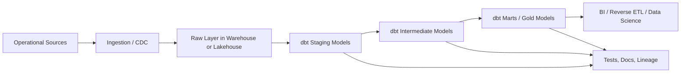
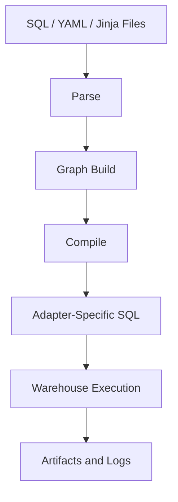

# Part 1 - Understanding dbt

## What problems dbt solves

Before dbt, many analytics teams had a common failure mode:

- raw data landed in a warehouse
- SQL transformations were scattered across BI tools, notebooks, stored procedures, or ad hoc scripts
- there was no dependency graph
- changes were hard to review
- testing was inconsistent
- documentation drifted
- production troubleshooting depended on tribal knowledge

dbt solves those problems by treating analytics SQL like software:

- models are files in version control
- dependencies are explicit through `ref()` and `source()`
- SQL is compiled deterministically
- tests are executable assets
- documentation is generated from code and metadata
- deployment and promotion can be automated

dbt is not just a transformation tool. It is a development workflow, project structure, dependency manager, compiler, testing framework, and metadata generator for analytics engineering.

## Why dbt was created

dbt was created because cloud warehouses made in-database transformation practical at scale. Once Snowflake, BigQuery, Redshift, Databricks SQL, and similar platforms made warehouse compute elastic enough, it became unnecessary to extract data out of the warehouse for many transformation workloads.

The key insight was simple:

- analysts and analytics engineers already know SQL
- business logic often belongs close to the data warehouse
- warehouses are better at set-based transformations than external orchestration scripts for many use cases

dbt emerged to provide a disciplined way to write those transformations as modular, testable, deployable code.

## ELT vs ETL

Traditional ETL:

- Extract from sources
- Transform in an external engine
- Load the transformed result into the warehouse

Modern ELT:

- Extract from sources
- Load raw data into the warehouse or lakehouse
- Transform inside the destination platform

Why ELT became dominant:

- cloud warehouses separated storage and compute
- SQL execution became cheap enough for many analytical use cases
- raw data retention enabled replay and re-modeling
- teams could centralize transformation logic in one place

When ETL is still appropriate:

- heavy row-by-row logic is easier in code than SQL
- low-latency operational processing is required
- complex machine learning feature engineering needs Python or Spark-native processing
- sensitive data must be masked before landing in the warehouse

When ELT is a strong fit:

- analytical transformations are set-based
- warehouse compute is already the main execution platform
- teams want lineage, testing, and modular SQL workflows

## Where dbt fits in the modern data stack

Typical stack:

- ingestion: Fivetran, Airbyte, custom CDC, Kafka, Spark streaming
- storage/compute: Snowflake, BigQuery, Redshift, Databricks, Spark SQL
- transform: dbt Core or dbt Cloud
- orchestration: Airflow, Dagster, Prefect, Azure Data Factory, GitHub Actions, Databricks Workflows
- BI/consumption: Power BI, Tableau, Looker, Sigma
- monitoring: Monte Carlo, elementary, custom alerts, warehouse observability

dbt does not replace ingestion, storage, or BI. It sits in the transformation and analytics engineering layer.

## dbt architecture

dbt Core has several important internal components:

- parser: reads project files and macros
- compiler: resolves Jinja, `ref()`, `source()`, configs, variables
- graph builder: constructs the DAG
- adapter: translates generic dbt behavior into warehouse-specific SQL behavior
- runner: executes nodes in dependency order using threads
- artifact writer: emits `manifest.json`, `run_results.json`, docs metadata, and logs

## How dbt differs from Spark jobs

dbt is not a general-purpose distributed compute framework. Spark is.

dbt:

- builds a dependency graph of data assets
- compiles SQL or Python models into warehouse-native execution
- delegates execution to the target engine
- focuses on analytics engineering workflows

Spark jobs:

- execute arbitrary distributed data processing logic
- support low-level control over partitions, shuffles, joins, caching, and file formats
- are suitable for ETL, ML, streaming, and custom compute-heavy transformations

Use dbt when:

- SQL expresses the logic clearly
- the warehouse or lakehouse already has the right compute engine
- governance, lineage, testing, and maintainability matter more than custom runtime control

Use Spark jobs when:

- you need procedural or iterative transformations
- you need custom file I/O behavior or non-SQL libraries
- your logic is not naturally modeled as SQL assets

## How dbt differs from stored procedures

Stored procedures are often imperative. dbt models are declarative.

Stored procedures usually say:

- do step A
- then step B
- then update table C

dbt usually says:

- this model depends on those upstream assets
- here is the SQL definition of the relation
- the DAG decides run order

Stored procedures can become opaque because business logic, orchestration, and side effects mix together. dbt encourages asset-oriented modeling with isolated transformations.

When stored procedures may still be useful:

- complex administrative actions
- warehouse-specific operational workflows
- niche transaction-oriented requirements

Common anti-pattern:

- recreating stored procedure style imperative pipelines inside dbt hooks and macros

That undermines lineage and predictability.

## How dbt differs from traditional ETL tools

Traditional ETL tools often emphasize visual pipelines and row-oriented transformation components. dbt emphasizes code-first SQL transformation.

Trade-offs:

- visual ETL can help less technical users, but complex logic often becomes harder to review
- dbt is more transparent for SQL-first teams, but requires engineering discipline

dbt typically wins when:

- the team is comfortable with SQL and Git
- transformations are mostly relational
- reproducibility, reviewability, and standardization matter

Traditional ETL may still win when:

- many users cannot code
- workflows depend heavily on non-SQL connectors and procedural transforms

## Why organizations adopt dbt

Organizations adopt dbt because it creates a common operating model for analytics transformation:

- shared definitions of metrics and dimensions
- version-controlled business logic
- testable transformations
- CI/CD compatibility
- clear lineage for change management
- reduced BI-layer logic sprawl

This improves trust in data and reduces the cost of change.

## Key takeaways

- dbt makes analytics SQL operate like software.
- It is strongest in ELT-oriented warehouse and lakehouse platforms.
- It complements, not replaces, ingestion, orchestration, BI, or Spark.
- Its real value is maintainability, lineage, testing, and standardization.

## Hands-on exercises

1. Draw your current data stack and mark where dbt would fit.
2. Identify three SQL transformations in your organization that should move out of BI tools into dbt.
3. Compare one existing ETL pipeline with a hypothetical dbt DAG.

## Interview questions

1. What problem does dbt solve beyond just running SQL?
2. Why did dbt become more relevant after cloud warehouses became popular?
3. When would you prefer Spark over dbt?

---
