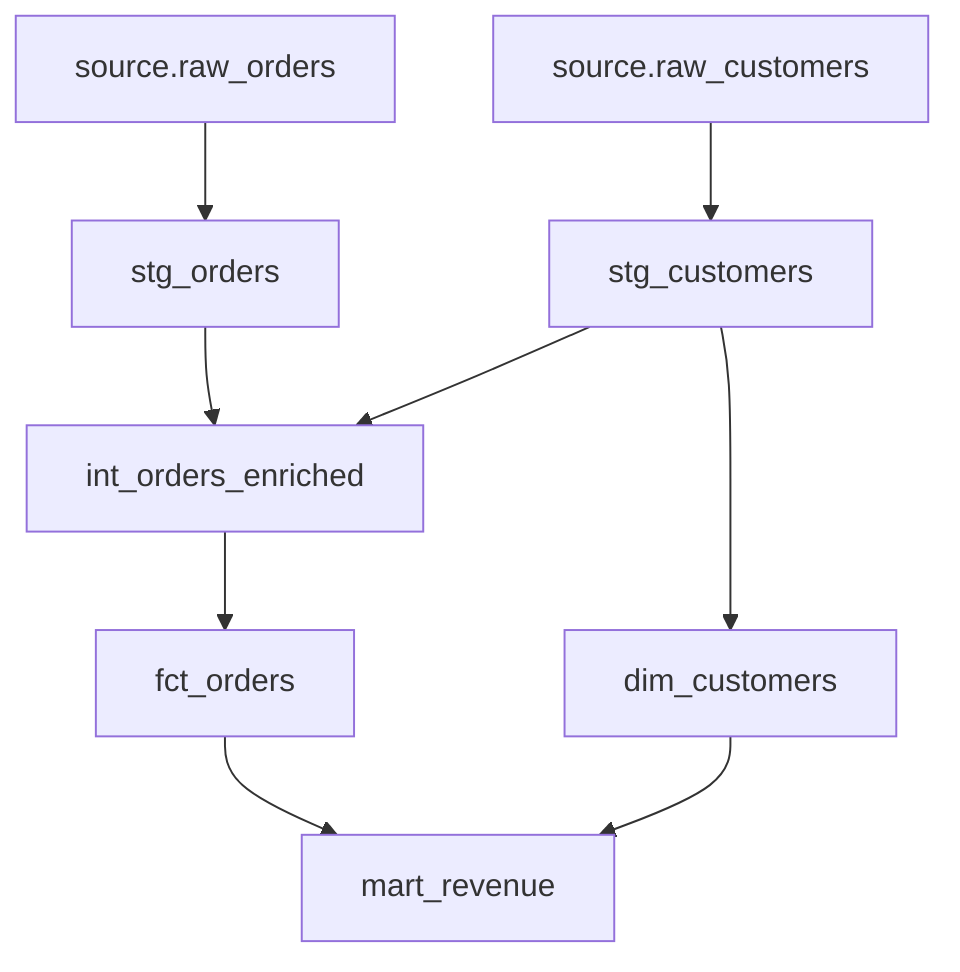

# Part 6 - DAG

## How dbt builds DAGs

dbt parses project resources and identifies dependencies from:

- `ref()`
- `source()`
- tests attached to resources
- snapshots and exposures relationships

The graph is a directed acyclic graph because cycles are not allowed.

## `ref()`

`ref('model_name')` does two things:

1. creates a dependency edge in the DAG
2. resolves the fully qualified relation name for the target environment

Why this matters:

- you should never hardcode upstream model schemas or relation names

## `source()`

`source('source_name', 'table_name')` references declared external relations and creates lineage from raw assets.

## Dependency graph

dbt knows execution order by topologically sorting the graph. A node runs only after all parents succeed, unless selection or deferral alters behavior.

## Compile phase

During compile, dbt:

- resolves configs
- expands Jinja
- resolves refs and sources
- generates adapter-specific SQL

Compiled files are written under the target directory.

## Execution phase

During execution, dbt:

- creates connections through the adapter
- submits SQL in dependency order with thread-level parallelism
- records timing and status in artifacts

## Manifest.json

`manifest.json` is the canonical project graph artifact. It contains:

- nodes and resources
- configs
- dependencies
- compiled metadata
- docs metadata

Why it matters:

- CI, lineage tools, docs sites, and state comparison all rely on it

## Run Results

`run_results.json` records:

- executed nodes
- statuses
- timing
- adapter responses

This is essential for debugging and orchestration integrations.

## Catalog

Catalog artifacts capture relation and column metadata collected from the warehouse for docs generation.

## Key takeaways

- dbt execution order is graph-driven, not file-order-driven.
- `ref()` and `source()` are both naming abstractions and dependency declarations.
- Artifacts are operationally important, not just metadata byproducts.

## Hands-on exercises

1. Draw a simple DAG using two sources, three staging models, and two marts.
2. Explain what breaks when upstream models are referenced with hardcoded table names.
3. Inspect a sample `manifest.json` from another project and find dependency edges.

## Interview questions

1. How does dbt know execution order?
2. What information is stored in `manifest.json`?
3. Why is `ref()` better than hardcoded relation names?

---
