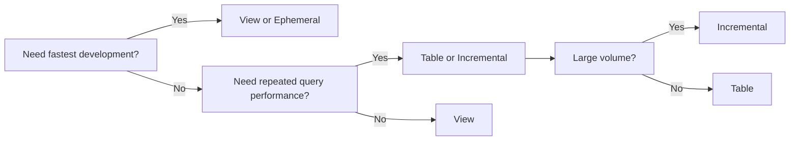

# Part 7 - Materializations

## View

Internal working:

- dbt compiles model SQL
- materialization issues `create or replace view ... as select ...`

Typical generated SQL shape:

```sql
create or replace view analytics.stg_orders as
select *
from raw.orders
```

Performance:

- no storage duplication for result set itself
- query cost paid at read time
- repeated downstream use may recompute complex logic often

Pros:

- always fresh relative to upstream tables
- low storage overhead
- fast development iteration

Cons:

- repeated query execution cost
- can stack into deeply nested view chains
- optimizer behavior may degrade with very complex dependency layers

When to use:

- lightweight staging logic
- simple renaming, casting, filtering

When not to use:

- heavy transformations referenced frequently
- warehouses where deep view nesting hurts performance or manageability

## Table

Internal working:

- dbt creates or replaces a physical table from model SQL

Generated SQL shape:

```sql
create or replace table analytics.dim_customers as
select ...
```

Performance:

- read performance is usually better and more predictable than complex views
- rebuild cost can be high for large tables

Storage:

- consumes warehouse storage

When to use:

- frequently queried marts
- dimensions and facts with stable refresh cadence

When not to use:

- rapidly iterated staging objects where rebuild cost is unnecessary

## Incremental

Internal working:

- first run behaves like a full table build
- subsequent runs process only a subset according to strategy and predicates

Performance and cost depend entirely on:

- correct grain
- effective filter predicates
- adapter strategy
- partitioning and clustering design

When to use:

- large datasets where full rebuilds are too expensive or slow

When not to use:

- small tables where incremental complexity adds more risk than benefit
- models without a stable unique key or reliable change detection

## Ephemeral

Internal working:

- dbt does not create a physical relation
- the model SQL is inlined as a CTE into downstream models

Generated SQL shape:

```sql
with __dbt__cte__int_orders as (
    select ...
)
select *
from __dbt__cte__int_orders
```

Pros:

- no storage objects created
- useful for small reusable intermediate logic

Cons:

- compiled SQL can become very large
- no standalone inspectable relation for debugging
- repeated downstream use may duplicate execution effort

When to use:

- small intermediate transformations used in a narrow scope

When not to use:

- large shared logic reused by many models
- models needing direct analyst inspection

## Materialized View

Support depends on adapter and warehouse. Semantics vary.

Pros:

- warehouse-managed refresh behavior
- potentially strong query performance for stable aggregations

Cons:

- platform-specific limitations
- reduced portability
- refresh control may be less flexible than dbt-managed tables

## Materialization comparison



## Key takeaways

- Materialization choice is an engineering trade-off, not a default preference.
- View is simple, table is predictable, incremental is powerful, ephemeral is selective.
- Materialization decisions should reflect query patterns, cost, and operational complexity.

## Hands-on exercises

1. Classify ten candidate models by materialization and justify each choice.
2. Compare downstream performance of a deep view stack versus persisted tables conceptually.
3. Identify one model where ephemeral would be harmful.

## Interview questions

1. Why is incremental not always the best choice for large models?
2. What are the debugging drawbacks of ephemeral models?
3. When are views preferable to tables?

---
