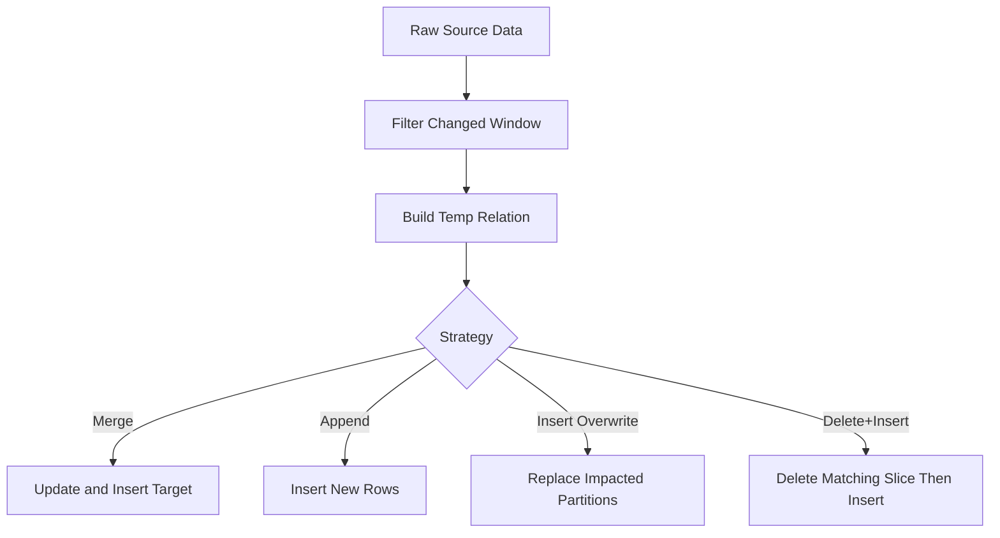

# Part 8 - Incremental Models

## Why incremental models matter

Incremental models are where dbt moves from convenient to enterprise-critical. They are often the difference between a pipeline that costs dollars and one that costs thousands.

## Incremental strategy

The model typically includes:

- an `is_incremental()` condition
- a predicate that filters newly changed or newly arrived data
- optional `unique_key`
- optional adapter-specific incremental strategy

Example:

```sql
{{ config(materialized='incremental', unique_key='order_id') }}

select
    order_id,
    customer_id,
    order_status,
    updated_at
from {{ source('raw', 'orders') }}

where updated_at >= (
    select coalesce(max(updated_at), '1900-01-01')
    from {{ this }}
)

```

This example is useful, but incomplete for real production because late-arriving records can be missed.

## Merge

Common in Snowflake, Databricks, and BigQuery variants.

Pattern:

- stage changed rows
- merge into target using unique key
- update matched rows
- insert new rows

Illustrative generated SQL shape:

```sql
merge into analytics.fct_orders as target
using analytics.__dbt_tmp_fct_orders as source
on target.order_id = source.order_id
when matched then update set ...
when not matched then insert (...)
```

Pros:

- supports updates and inserts
- good for mutable records

Cons:

- can be expensive if the match predicate scans too much data
- requires careful unique key discipline

## Insert Overwrite

Common in partition-oriented systems.

Pattern:

- rebuild only impacted partitions
- overwrite those partitions atomically or near-atomically depending on platform

Best for:

- very large partitioned tables
- date-based facts where recent partitions change more often

## Delete + Insert

Pattern:

- delete matching keys or partitions from target
- insert refreshed rows

Useful when merge is unavailable or less efficient.

Risk:

- larger write amplification
- requires careful transaction semantics on the platform

## Append

Pattern:

- only insert new rows
- no updates to existing rows

Best for:

- immutable event streams

Unsafe when:

- source records can be updated or corrected

## Partitioning

Partitioning allows the engine to scan less data. Good partition strategy should match dominant filter patterns and update windows.

Common mistake:

- partitioning by a very high-cardinality column or a column not used for pruning

## Watermarks

A watermark is the boundary that determines what new data to process.

Safer pattern for late data:

```sql
where updated_at >= (
    select dateadd(day, -2, coalesce(max(updated_at), '1900-01-01'))
    from {{ this }}
)
```

This intentionally overlaps processing windows.

Trade-off:

- more data rescanned
- fewer missed late-arriving rows

## Late arriving data

This is one of the most common enterprise failures. If your ingestion is delayed or source systems backfill updates, a strict `max(updated_at)` filter is usually unsafe.

Mitigations:

- overlap window
- source ingestion timestamp fallback
- partition-level reprocessing
- periodic full or semi-full backfills

## Reprocessing and backfills

You need an operational strategy for:

- rerunning one partition
- rerunning a date range
- rebuilding a table fully
- replaying corrected source history

Best practice:

- design models so backfills are routine, not emergency-only events

## Schema evolution

Upstream schema changes can break incremental models or silently produce nulls. Plan for:

- added columns
- changed types
- renamed columns
- removed columns

Strong teams combine source contracts, model contracts, and schema change alerting.

## Full refresh

`dbt run --full-refresh` drops and rebuilds incremental relations. Use when:

- logic changed materially
- historical corrections require full recomputation
- unique key strategy was previously wrong

Do not normalize full refreshes as routine if the model is meant to be incremental. That defeats the purpose.

## Incremental execution diagram



## Common mistakes

- no declared grain or unique key
- relying on source timestamps without lateness analysis
- incrementalizing small tables that should just be rebuilt
- no backfill plan
- not testing duplicate emergence after merges

## Key takeaways

- Incremental models are a performance optimization and an operational design problem.
- Correctness matters more than speed. A fast wrong incremental model is a liability.
- Overlapping windows and partition-aware design are common enterprise necessities.

## Hands-on exercises

1. Design incremental logic for an orders table with late updates up to 48 hours late.
2. Compare merge and insert overwrite strategies on Snowflake versus Databricks conceptually.
3. Write a runbook for backfilling one month of data.

## Interview questions

1. Why is `max(updated_at)` often insufficient for production incremental logic?
2. When is append strategy safe?
3. What conditions justify a full refresh?

---
