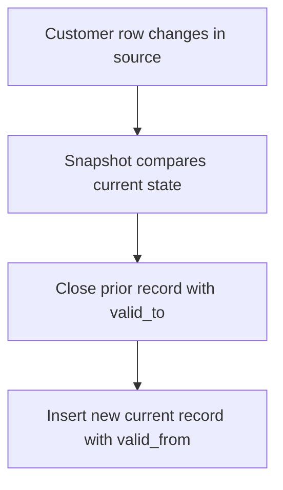

# Part 11 - Snapshots

## SCD Type 2 in detail

SCD Type 2 preserves history by keeping multiple versions of the same business entity across time.

Typical columns:

- business key such as `customer_id`
- changing attributes such as status or segment
- `dbt_valid_from`
- `dbt_valid_to`
- current-record indicator derived from `dbt_valid_to is null`



## Timestamp strategy

Uses an `updated_at` style column to detect changes.

Best when:

- source update timestamps are reliable

Risk:

- missed history if timestamps are not updated consistently

## Check strategy

Compares a defined list of columns for changes.

Best when:

- reliable update timestamp is unavailable

Risk:

- more expensive comparison logic
- column list maintenance burden

## Valid From and Valid To

These columns define the effective time window of a version. They support historical joins such as:

- what was the customer segment when the order occurred?

## Current Record

Common pattern:

```sql
case when dbt_valid_to is null then true else false end as is_current
```

## When to use snapshots

- mutable dimensions without existing history
- auditability requirements
- historical point-in-time analysis

## When not to use snapshots

- append-only event data
- sources that already provide full CDC history
- situations where periodic full table snapshots are unnecessarily expensive

## Common mistakes

- snapshotting everything by default
- joining facts to current dimension instead of historical valid window
- trusting unreliable `updated_at` fields

## Key takeaways

- Snapshots are about historical truth, not just current-state convenience.
- Strategy choice depends on source reliability.
- Historical joins require careful validity-window logic downstream.

## Hands-on exercises

1. Design a customer dimension snapshot with timestamp strategy.
2. Explain how to join orders to the correct historical customer tier.
3. Identify when CDC tables make dbt snapshots unnecessary.

## Interview questions

1. What is the difference between timestamp and check snapshot strategies?
2. Why can current-state joins produce incorrect historical analytics?
3. When would you avoid snapshots entirely?

---
