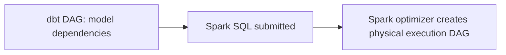

# Part 17 - dbt with Spark

## Relationship between dbt and Spark

dbt can target Spark or Spark-adjacent SQL engines through adapters such as Databricks or Spark. In this setup, dbt is still the transformation compiler and DAG manager, while Spark is the execution engine.

## Spark DAG vs dbt DAG

Spark DAG:

- physical execution plan of transformations inside Spark

dbt DAG:

- logical dependency graph between data assets

These are not the same thing.

## Why Spark jobs do not appear when running dbt

dbt submits SQL or model logic to the engine through the adapter. It does not create hand-authored Spark application code by default. The Spark platform internally plans and executes the query.

## Databricks integration

With Databricks, dbt typically interacts through SQL warehouses or clusters depending on setup and adapter capabilities.

Important considerations:

- cluster startup latency
- SQL warehouse sizing
- Delta Lake merge performance
- Unity Catalog naming and permissions

## Delta Lake

Delta Lake matters for:

- ACID tables
- merge support
- file compaction behavior
- schema evolution patterns

## Unity Catalog

Unity Catalog adds governance boundaries across catalogs, schemas, and objects. dbt projects should align naming and environment strategy with catalog governance.

## Spark SQL and Photon

Spark SQL is the query language layer; Photon is an accelerated execution engine in Databricks environments. dbt benefits from those execution improvements indirectly because the warehouse or SQL engine runs the compiled SQL.

## Cluster usage

Be deliberate about:

- job cluster vs all-purpose cluster
- auto-scaling
- concurrency contention
- cluster warm-up costs

## Execution flow

1. dbt parses and compiles model SQL
2. adapter submits SQL to Spark or Databricks engine
3. engine optimizer creates physical execution plan
4. data reads, shuffles, joins, merges execute
5. dbt records results and artifacts

## Key takeaways

- dbt does not replace Spark; it orchestrates SQL transformations on Spark-capable engines.
- dbt DAG and Spark execution DAG are different abstraction layers.
- Delta Lake and Databricks platform behavior strongly influence incremental design and performance.

## Hands-on exercises

1. Explain how a dbt incremental merge maps onto Delta Lake behavior.
2. Compare logical asset lineage with Spark physical execution planning.
3. Design environment separation using Unity Catalog.

## Interview questions

1. Why does running dbt on Databricks not create traditional Spark applications?
2. What is the difference between dbt DAG and Spark DAG?
3. How does Delta Lake affect dbt incremental behavior?

---
