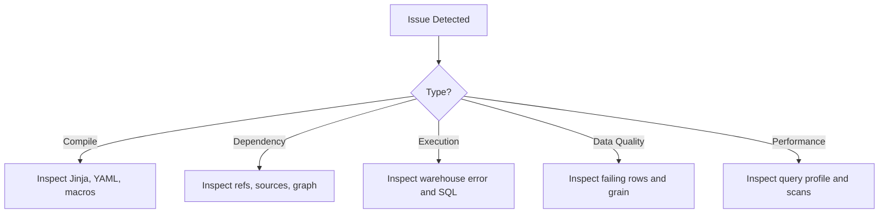

# Part 20 - Troubleshooting

## Common errors

Troubleshooting dbt starts with category identification:

- compilation error
- dependency graph error
- execution error
- data quality failure
- performance issue

## Compilation errors

Typical causes:

- broken Jinja syntax
- undefined macros or variables
- invalid YAML
- bad config inheritance assumptions

Technique:

- inspect compiled SQL or parse logs
- reduce scope with model selection

## Dependency errors

Typical causes:

- missing upstream resource
- cyclic dependency
- wrong `ref()` or `source()` names

## Incremental failures

Typical causes:

- duplicate unique keys
- merge statement errors
- schema drift
- incorrect filter window

## Snapshot failures

Typical causes:

- unstable unique key
- invalid strategy columns
- source type changes

## Schema mismatch

Typical causes:

- upstream column rename
- changed type
- contract violation

## Duplicate rows

Investigate:

- grain definition
- join explosion
- merge key quality
- source duplication

## Performance issues

Investigate:

- large scans
- deep view nesting
- poor incremental filters
- skewed joins
- excessive thread contention

## Debugging techniques

- run narrow selections
- inspect compiled SQL
- inspect artifacts
- query persisted failure tables
- compare current and prior manifests
- reproduce in a dedicated dev schema

## Logs

Logs help distinguish compile failures from warehouse execution failures. Mature teams centralize log access for incident response.

## Artifacts

Artifacts provide:

- what ran
- what changed
- what failed
- timings
- lineage context

## Troubleshooting workflow

## Key takeaways

- Fast troubleshooting comes from narrowing the failure class quickly.
- Compiled SQL and artifacts are your primary debugging assets.
- Many dbt failures are actually data modeling or platform behavior failures expressed through dbt.

## Hands-on exercises

1. Create a runbook for debugging a failed incremental merge.
2. Explain how you would diagnose duplicate rows in a fact model.
3. List the first three places you would inspect after a compilation error.

## Interview questions

1. What artifacts are most useful when debugging dbt?
2. How would you troubleshoot a model that suddenly doubled in row count?
3. Why should you inspect compiled SQL during debugging?

---
