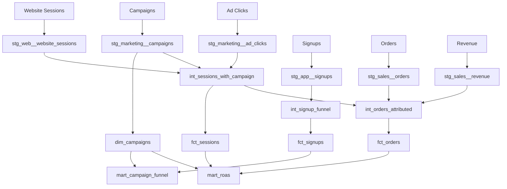

# Part 21 - Real Enterprise Project

## Marketing Analytics project overview

Build a realistic end-to-end analytics project using these raw sources:

- ad_clicks
- campaigns
- website_sessions
- signups
- orders
- revenue

Business goals:

- campaign performance reporting
- funnel conversion analysis
- CAC and ROAS measurement
- attribution-supporting curated data

## Raw sources

Examples:

- `raw_marketing.ad_clicks`
- `raw_marketing.campaigns`
- `raw_web.website_sessions`
- `raw_app.signups`
- `raw_sales.orders`
- `raw_sales.revenue`

Source definitions should include tests and freshness.

## Staging

Examples:

- `stg_marketing__ad_clicks`
- `stg_marketing__campaigns`
- `stg_web__website_sessions`
- `stg_app__signups`
- `stg_sales__orders`
- `stg_sales__revenue`

Staging tasks:

- rename columns consistently
- cast timestamps to canonical timezone strategy
- standardize campaign identifiers
- deduplicate obvious ingestion duplicates

## Intermediate

Examples:

- `int_sessions_with_campaign`
- `int_signup_funnel`
- `int_orders_attributed`

Purpose:

- session-to-campaign mapping
- first-touch and last-touch helper logic
- order enrichment with signup and campaign context

## Dimensions

Examples:

- `dim_campaigns`
- `dim_customers`
- `dim_dates`

Consider snapshotting `campaigns` or `customers` if attributes change historically.

## Facts

Examples:

- `fct_ad_clicks`
- `fct_sessions`
- `fct_signups`
- `fct_orders`
- `fct_revenue`

Each fact must declare grain clearly. Example:

- `fct_orders`: one row per order
- `fct_sessions`: one row per session

## Gold models

Examples:

- `mart_marketing_daily_performance`
- `mart_campaign_funnel`
- `mart_roas`

Possible metrics:

- clicks
- sessions
- signups
- orders
- revenue
- CAC
- conversion rate
- ROAS

## Snapshots

Candidate snapshots:

- campaign budget or status changes
- customer lifecycle tier changes

## Tests

Examples:

- unique session IDs
- not null order IDs
- accepted campaign status values
- relationships from facts to dimensions
- business test: revenue should not exist without an order

## Documentation

Document:

- attribution logic and limitations
- grain of each fact
- refresh cadence
- owner and downstream dashboards

## Macros

Potential reusable macros:

- channel normalization
- safe marketing efficiency calculations
- standardized surrogate key generation

## CI/CD

Recommended:

- PR compile and slim tests
- main branch build in QA
- production deployment with published artifacts

## Monitoring and alerting

Monitor:

- source freshness
- row count anomalies
- failed tests
- runtime regressions
- cost spikes on incremental models

Alerting examples:

- stale ad click ingestion
- unexpected drop in sessions
- duplicate order IDs in fact table

## Deployment

Deployment pattern:

1. merge approved pull request
2. build QA with updated branch artifacts
3. promote main to prod job
4. publish docs and artifacts
5. monitor post-deploy tests and freshness

## Example architecture diagram



## Example generated SQL pattern

Illustrative mart:

```sql
select
    campaign_id,
    date_day,
    sum(clicks) as clicks,
    sum(sessions) as sessions,
    sum(signups) as signups,
    sum(orders) as orders,
    sum(revenue) as revenue,
    {{ safe_divide('sum(revenue)', 'nullif(sum(spend), 0)') }} as roas
from {{ ref('fct_marketing_daily') }}
group by 1, 2
```

## Common anti-patterns in this project

- mixing attribution logic directly into BI dashboards
- no clear grain for funnel models
- using append-only incremental logic on mutable orders
- snapshotting fact tables instead of mutable dimensions
- skipping source freshness on paid media feeds

## Operating model for this project

- marketing domain owns source contracts and marts
- platform team owns CI/CD, environments, and package standards
- data quality alerts route by ownership group

## Key takeaways

- Real enterprise dbt success depends on model design, ownership, CI/CD, and observability together.
- The raw-to-staging-to-intermediate-to-mart flow keeps complexity manageable.
- Business semantics such as attribution must be documented as carefully as SQL.

## Hands-on exercises

1. Design the YAML for all six raw sources including tests and freshness.
2. Define grain and keys for every fact and dimension in this project.
3. Write a backfill plan for campaign attribution logic after a bug fix.

## Interview questions

1. How would you model campaign attribution in dbt without hiding business logic?
2. Which models in this project should be incremental and why?
3. What should monitoring cover beyond failed dbt runs?

---

# Final Study Guidance

To become enterprise-capable with dbt, study in this order:

1. fundamentals of asset-oriented SQL modeling
2. project structure and DAG mechanics
3. materializations and incremental processing
4. testing, sources, and snapshots
5. macros, packages, and cross-platform design
6. CI/CD, artifacts, and production operations
7. performance tuning and organizational governance

The transition from beginner to senior analytics engineer happens when you stop asking only "How do I make dbt run?" and start asking:

- Is this model at the correct grain?
- Is this logic testable and reviewable?
- Can this be backfilled safely?
- Will this scale operationally across environments and teams?
- Is the cost justified by the materialization and runtime design?

That mindset is what turns dbt from a tool into an engineering discipline.
